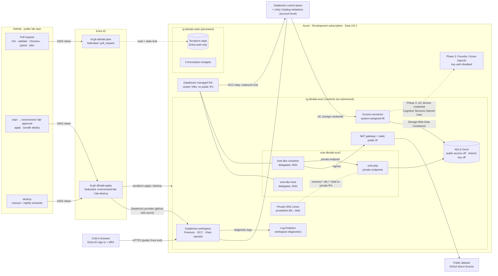
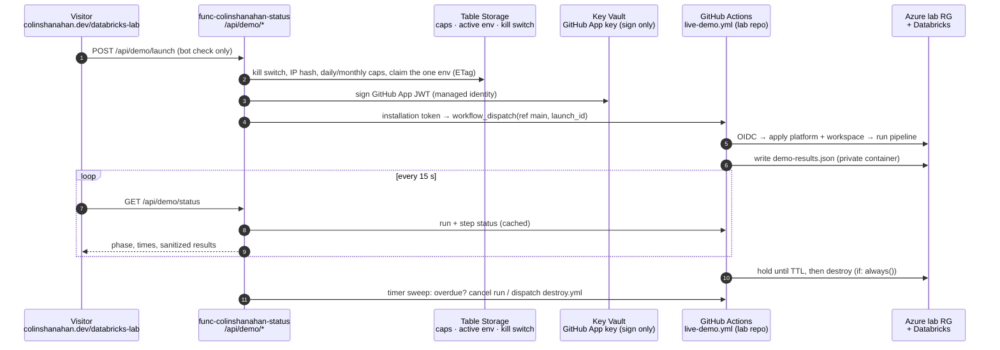

# Design: Azure Databricks platform lab

| | |
|---|---|
| **Status** | **Accepted** (2026-10-09; decisions in #61). The maintained copy is [ADR-0001 in the lab repo](https://github.com/cjshanahan1228/azure-databricks-platform-lab/blob/main/docs/adr/0001-databricks-platform-lab-design.md), which carries later amendments and the [implementation notes](https://github.com/cjshanahan1228/azure-databricks-platform-lab/blob/main/docs/adr/README.md). This copy is kept for history. |
| **Owner** | Colin Shanahan (`cjshanahan1228`) |
| **Date** | 2026-10-06, updated 2026-10-09 (added the visitor-triggered on-demand demo, §10) |
| **Scope of this doc** | Design only. Nothing has been deployed, no Terraform has run, and nothing gets built until Colin approves the design. |

## Contents

1. [Goal and what it proves](#1-goal-and-what-it-proves)
2. [Scope](#2-scope)
3. [Architecture](#3-architecture)
4. [Networking](#4-networking)
5. [Identity and secrets](#5-identity-and-secrets)
6. [Terraform layout](#6-terraform-layout)
7. [CI/CD](#7-cicd)
8. [Data pipeline (phase 2) and AI piece (phase 3)](#8-data-pipeline-phase-2-and-ai-piece-phase-3)
9. [Cost comparison: operating models](#9-cost-comparison-operating-models)
10. [On-demand demo (visitor-triggered)](#10-on-demand-demo-visitor-triggered)
11. [Guardrails](#11-guardrails)
12. [Showcasing on colinshanahan.dev](#12-showcasing-on-colinshanahandev)
13. [Repo question](#13-repo-question)
14. [Phased plan and learning track](#14-phased-plan-and-learning-track)
15. [Risks and open questions](#15-risks-and-open-questions)
16. [Sources](#16-sources)

---

## 1. Goal and what it proves

Build a small Azure Databricks platform that is private by default, keyless, deployed entirely from Terraform through GitHub Actions, and cheap to run. Use it to back up three claims that the resume can't make today: **Databricks (with Unity Catalog)**, **Azure OpenAI / Azure AI Foundry**, and **production-style Python**. The build doubles as a guided way for Colin to learn Databricks (see the [learning track](#14-phased-plan-and-learning-track)), and the result gets shown on colinshanahan.dev.

It is a personal lab and should always be described that way. It shows how Colin designs, builds, and explains a platform. It does not claim production Databricks experience.

### Mapping to the Howden Senior Platform Engineer (Azure, Data & AI) posting

Requirement wording is paraphrased from the public posting (see [Sources](#16-sources)).

| Howden asks for | What in this lab demonstrates it | Phase |
|---|---|---|
| Terraform at scale: modules, state, multi-environment, drift | Split root modules (bootstrap / platform / workspace config), reusable modules, remote state with Entra auth, plan on PR, scheduled drift plan (always-on mode) | 1 |
| Azure networking: private endpoints and Private Link, DNS, NSGs, firewalls | VNet injection, secure cluster connectivity (no public IPs), NAT gateway egress, private endpoints and private DNS zones for ADLS, an optional back-end Private Link toggle, and a written front-end Private Link trade-off | 1 |
| Entra ID, managed identities, RBAC, Key Vault | GitHub OIDC to user-assigned managed identities, a Unity Catalog access connector (managed identity) to ADLS, least-privilege role assignments, and a written explanation of why Key Vault isn't needed | 1, 3 |
| Databricks, Unity Catalog, cluster policies, workspace governance | Premium workspace, UC catalog/schemas/external location/storage credential, grants, and a cluster policy that enforces node size, auto-termination, and tags | 1–2 |
| Lakehouse and Delta patterns, SQL, ingestion and orchestration | Bronze/silver/gold Delta tables from a public dataset, run as a Lakeflow job and deployed with a bundle | 2 |
| Strong Python, automated testing | Pipeline logic as a typed Python package with pytest unit tests running in CI | 2 |
| Azure AI Foundry / Azure OpenAI / AI Search: deployment, quota, access | A Foundry (AI Services) resource with a small model deployment, explicit TPM quota, local (key) auth disabled, called from Databricks through a UC service credential, plus optional AI Search RAG | 3 |
| AI gateway patterns (preferred) | Optional stretch: API Management in front of Azure OpenAI with a token limit policy | 3 (stretch) |
| CI/CD with approval gates and automated testing | Plan on PR, apply gated by a GitHub environment approval, Checkov/Trivy scanning, pytest, bundle validation | 1–2 |
| Cost visibility for the platform you run | Consumption budgets in Terraform, tagging, cluster policies, and a published actual-vs-estimate cost comparison | 1, 4 |
| Databricks certification (preferred) | Not delivered by the lab itself. The learning track points to the relevant certifications as an optional follow-up. | Later |
| Agent-assisted development (daily use of coding agents) | Honest note in the write-up about which parts were agent-assisted and which Colin wrote and verified himself | 4 |

Not covered, and intentionally out of scope: hub-and-spoke landing zones, Azure Firewall, Purview, Agent 365/Entra Agent ID, AKS, and ITSM integration.

## 2. Scope

**In scope (phase 1, the platform):**
- An Azure Databricks **Premium** workspace. Premium isn't optional. Azure stopped allowing new Standard-tier workspaces on April 1, 2026, and Unity Catalog, serverless, IP access lists, and Private Link all require Premium anyway.
- VNet injection with secure cluster connectivity (no public IPs on cluster nodes), a NAT gateway for egress, and private endpoints plus private DNS for the lakehouse storage account.
- An ADLS Gen2 account with public network access off and shared-key auth off, reached through a Unity Catalog access connector.
- Unity Catalog objects: storage credential, external location, a lab catalog with bronze/silver/gold schemas, grants, and a cluster policy.
- GitHub Actions: plan on PR, gated apply, destroy (manual and scheduled), and IaC scanning.
- Budgets, tags, and auto-termination.

**Later phases:**
- Phase 2: a Python lakehouse pipeline (bronze/silver/gold Delta) packaged as a Databricks bundle with pytest in CI.
- Phase 3: Azure OpenAI summarization over gold data via a keyless UC service credential, an optional AI Search RAG, and an optional API Management AI gateway as a stretch.
- Phase 4: the showcase write-up on colinshanahan.dev.
- Phase 5 (optional): a visitor-triggered on-demand demo, where a visitor starts the lab from the site and it tears itself down after a fixed time (§10).

**Out of scope:** front-end Private Link (designed and priced here, not built; see §4), Azure Firewall/NVA egress inspection, customer-managed keys, multiple environments (dev/prod), Purview, Databricks Vector Search and Model Serving endpoints (both bill while idle), and any real or confidential data. Only public datasets are used.

## 3. Architecture



**How to read it:**
- **Control plane vs compute plane.** Databricks runs the web app, job scheduler, and Unity Catalog in its own control plane. Clusters (the compute plane) run as VMs in a Databricks-managed resource group in *our* subscription, attached to *our* VNet. With secure cluster connectivity, those VMs have no public IPs and dial *out* to the control plane through a relay. Nothing dials in.
- **Data path.** A job cluster pulls the public dataset out through the NAT gateway, then writes Delta tables to ADLS through a private endpoint. Unity Catalog hands the cluster short-lived storage access based on the access connector's managed identity. No storage keys are involved.
- **Deploy path.** GitHub Actions exchanges its OIDC token for an Entra token on a user-assigned managed identity. Terraform (azurerm plus databricks providers) and the Databricks CLI both use that token. No secret is stored anywhere.

## 4. Networking

### Building blocks

| Piece | Design |
|---|---|
| VNet | `vnet-dbxlab-eus2`, e.g. `10.60.0.0/23` (confirm it doesn't overlap anything Colin peers or VPNs into) |
| Databricks subnets | `snet-dbx-host` `10.60.0.0/25` and `snet-dbx-container` `10.60.0.128/25`, both delegated to `Microsoft.Databricks/workspaces` and each with an NSG. Databricks requires at least /26. /25 leaves headroom. |
| Private endpoint subnet | `snet-pep` `10.60.1.0/27` |
| Egress | NAT gateway with one static public IP on both Databricks subnets. This is required, not optional: with SCC the nodes have no public IPs, and new VNets created on current API versions get private subnets with no default outbound access (Microsoft retired default outbound access for new VNets). |
| Storage | ADLS Gen2 with `public_network_access_enabled = false`, private endpoints for `dfs` (required) and `blob` (recommended), private DNS zones `privatelink.dfs.core.windows.net` and `privatelink.blob.core.windows.net` linked to the VNet, and a resource-instance rule allowing the access connector |
| Service endpoints | Not needed. Note that Azure's new "standard service endpoint" (preview) has a planned per-VNet hourly charge, so don't confuse it with classic service endpoints. |

### The trade-off: VNet injection only vs adding Private Link

Azure Databricks has three independent network controls, and "private" can mean any combination of them.

| Option | What it makes private | Extra cost (approx.) | Demo impact |
|---|---|---|---|
| **A. VNet injection + SCC + storage private endpoints** (recommended baseline) | Cluster nodes have no public IPs. Data to ADLS stays on private endpoints. Egress leaves through one known IP. | NAT ~$36.50/mo incl. IP, 2 storage PEs ~$14.60/mo, DNS ~$1/mo | None. Workspace UI reachable from any browser with Entra sign-in. |
| **B. A + back-end (classic compute plane) Private Link** | Cluster to control plane traffic (relay and REST) goes over a private endpoint instead of the public backbone. Requires `NoAzureDatabricksRules`. | +1 PE ~$7.30/mo + 1 DNS zone $0.50/mo | None. Still browser-reachable. |
| **C. B + front-end (inbound) Private Link with public access disabled** | The workspace UI and API are reachable *only* from a VNet. Needs a transit VNet, `databricks_ui_api` and `browser_authentication` private endpoints (Microsoft recommends a separate "web auth" workspace for the latter), and DNS. | +2 PEs ~$14.60/mo, plus a way in: VPN Gateway VpnGw1 ~$138.70/mo or Bastion Basic ~$138.70/mo, plus a jump VM (TBD) | **High.** A normal browser can't reach the workspace. Every demo needs a VPN or jump host, which is awkward when screen-sharing in an interview. The GitHub-hosted runner can't reach it either, so CI needs a self-hosted runner inside the network. |

**Recommendation:** build **A** in phase 1, then add **B** as a `enable_backend_private_link` toggle once A works. B is cheap and makes a good "here's how I'd tighten it" talking point. Write up **C** (diagram, cost, and why it wasn't built) rather than building it. That's the honest platform-engineer answer: it's the right control for production with real data, and the wrong one for a public-data lab that has to be demoed over Zoom.

**What about IP access lists?** These are a Premium feature that would restrict the public front end to Colin's IP. They're not recommended for phase 1, because they also block GitHub-hosted runners (dynamic IPs), so the Databricks provider and bundle deploys would fail. The front door is Entra ID with MFA. With public data only, that's an acceptable lab posture, and the doc says so plainly.

**Serverless note:** serverless compute runs in Databricks' account, not our VNet. To reach an ADLS account with public access off, it needs a network connectivity configuration (NCC) with private endpoint rules. The cost of serverless private connectivity is **TBD** (no rate found). Phases 1–2 use classic job compute. Serverless is an optional experiment.

## 5. Identity and secrets

### No-stored-secrets path, end to end

| Hop | Mechanism | What it authorizes |
|---|---|---|
| GitHub job → Azure | OIDC token (`sub: repo:<owner>/<repo>:pull_request` or `:environment:lab`), exchanged at Entra for a federated credential on a user-assigned managed identity | Plan identity: Reader on the lab RGs, plus Storage Blob Data Contributor on the state *container* (state locking needs write). Apply identity: Contributor on `rg-dbxlab-eus2`, plus Role Based Access Control Administrator *conditioned* to only assign Storage Blob Data Contributor and Cognitive Services OpenAI User. |
| Terraform → state | azurerm backend with `use_oidc = true`, `use_azuread_auth = true` | No storage keys. The state account has shared-key auth disabled. |
| Terraform → Databricks | databricks provider `auth_type = "github-oidc-azure"`, `azure_workspace_resource_id` | The apply identity is a workspace admin because it holds Contributor on the workspace resource. |
| Databricks CLI (bundles) → workspace | The same `github-oidc-azure` auth (`ARM_CLIENT_ID`, `ARM_TENANT_ID`, `DATABRICKS_HOST`) | Deploy jobs and code to the workspace |
| Cluster → ADLS | Unity Catalog storage credential → access connector (system-assigned MI) → RBAC on the storage account | UC vends short-lived credentials per query. Users never touch storage auth. |
| Cluster → Azure OpenAI (phase 3) | UC **service credential** on the access connector (`dbutils.credentials.getServiceCredentialsProvider(...)`), with `Cognitive Services OpenAI User` on the AI resource, and local (key) auth disabled on the resource | No API key exists to leak |
| Colin → workspace | Entra ID SSO (MFA) | Workspace user/admin |

**What's stored in GitHub:** only *variables*, not secrets: the client IDs of the two identities, tenant ID, subscription ID, and (if account-level resources are managed) the Databricks account ID. These are identifiers, not credentials, the same as in the portfolio repo today. None of them appear in this doc.

**Key Vault: not needed, so don't deploy it in phases 1–3.** Every hop above is identity-based. Adding a vault "because platforms have one" would add a soft-delete and purge-protection problem for ephemeral redeploys (see §9) and a resource that holds nothing. Azure Key Vault-backed Databricks secret scopes also only support the vault *access policy* permission model, not Azure RBAC, so using one would mean downgrading the vault's permission model. Introduce Key Vault only if a genuinely secret value appears, for example a third-party API key, and then prefer RBAC plus a UC service credential path where possible.

**One-time manual identity steps (Colin, by design):**
1. Apply the `bootstrap` stack locally with his own `az login`. It creates the state account, both managed identities, the federated credentials, role assignments, and budgets. CI can't create its own identity.
2. Sign in to the Databricks **account console**. If the account has no account admin yet, the first one must be an Entra Global Administrator when they first sign in. If admins already exist, one of them can add Colin. Confirm whether a Unity Catalog metastore already exists in East US 2 (one is allowed per region per account; accounts created after Nov 9, 2023 get one automatically). Either turn on auto-assignment of new workspaces to it, or grant the CI identity what it needs. Then grant the apply identity `CREATE CATALOG`, `CREATE STORAGE CREDENTIAL`, and `CREATE EXTERNAL LOCATION` on the metastore rather than making it an account admin.

## 6. Terraform layout

Proposed structure (in the dedicated repo; see §13):

```
azure-databricks-platform-lab/
├── infra/
│   ├── bootstrap/            # applied locally by Colin, rarely changes; persistent
│   │                         #   state storage account, rg-dbxlab-state, rg-dbxlab-eus2 (empty RG),
│   │                         #   CI identities + federated credentials, role assignments, budgets
│   ├── platform/             # azurerm, ephemeral: VNet, NSGs, NAT, PIP, private endpoints, DNS,
│   │                         #   ADLS, access connector, workspace, diagnostics → Log Analytics
│   ├── workspace/            # databricks provider, ephemeral: storage credential, external location,
│   │                         #   catalog/schemas, grants, cluster policy, (metastore assignment if needed)
│   └── modules/
│       ├── network/          # vnet, delegated subnets, nsgs, nat, optional back-end PL
│       ├── lakehouse-storage/# adls + private endpoints + dns
│       ├── databricks-workspace/
│       └── unity-catalog/
├── bundle/                   # phase 2: databricks.yml, resources/, src/lakehouse/, tests/
├── .github/workflows/        # ci.yml, deploy.yml, destroy.yml, bundle.yml, drift.yml (always-on only)
└── docs/                     # this design (as ADR-0001), runbooks, screenshots
```

**Why `platform` and `workspace` are separate roots:** the databricks provider is configured from the workspace's outputs. Configuring a provider from a resource created in the same state is a known Terraform anti-pattern that breaks plans when the workspace doesn't exist yet and breaks destroys in the wrong order. With two roots, `destroy` runs `workspace` first, which removes UC objects cleanly and leaves no orphaned external locations in the long-lived metastore, then `platform`.

**Providers:**
- `hashicorp/azurerm ~> 5.7`, matching the portfolio (lock file currently 5.8.0). Set `storage_use_azuread = true` because shared keys are disabled. Create containers with `storage_account_id` so they go through the ARM management plane, and the runner never needs data-plane network access to a storage account with public access off.
- `databricks/databricks ~> 1.137` (1.137.0 is the latest release on 2026-10-06; pin and let Dependabot bump it).
- `hashicorp/random` for globally unique name suffixes.

**State:**
- Use a **dedicated state storage account** in `rg-dbxlab-state` with shared-key auth disabled, Entra-only access, blob versioning, and soft delete. Keys: `bootstrap.tfstate`, `platform.tfstate`, `workspace.tfstate`.
- Why not the portfolio's `stcolinshanahanresume/tfstate`: that account holds the portfolio state, which contains real secrets (the SWA deploy token, the storage account key, and the ACS connection string). It also has shared-key access on by design, and the portfolio README already says to "prefer moving tfstate to its own account". The lab's CI identities, especially one that runs `destroy` on a schedule, should have no path to it at all. A separate account means separate RBAC and a zero blast radius between the two.
- Fallback if Colin prefers no new account: a separate container (`tfstate-dbxlab`) in the existing account with container-scoped roles, never a different key in the same `tfstate` container.

**Naming** ([CAF abbreviations](https://learn.microsoft.com/en-us/azure/cloud-adoption-framework/ready/azure-best-practices/resource-abbreviations), `<type>-dbxlab-<region>`):

| Resource | Name |
|---|---|
| Resource groups | `rg-dbxlab-state`, `rg-dbxlab-eus2`, managed: `rg-dbxlab-eus2-managed` |
| Workspace / access connector | `dbw-dbxlab-eus2` / `dbac-dbxlab-eus2` |
| VNet / subnets / NSGs | `vnet-dbxlab-eus2` / `snet-dbx-host`, `snet-dbx-container`, `snet-pep` / `nsg-dbx-host`, `nsg-dbx-container` |
| NAT / public IP | `ng-dbxlab-eus2` / `pip-ng-dbxlab-eus2` |
| Private endpoints | `pep-st-dfs-dbxlab`, `pep-st-blob-dbxlab` |
| Storage (lakehouse / state) | `stdbxlab<rand4>` / `stdbxlabtf<rand4>` (≤24 chars, no hyphens) |
| Identities | `id-gh-dbxlab-plan`, `id-gh-dbxlab-apply` |
| Log Analytics | `log-dbxlab-eus2` |
| Unity Catalog | catalog `dbxlab`, schemas `bronze`, `silver`, `gold` |

**Tags (all resources, and propagated to cluster VMs via cluster policy `custom_tags`):** `project=databricks-platform-lab`, `owner=colin`, `env=lab`, `lifecycle=persistent|ephemeral`, `managed_by=terraform`, `repo=<repo name>`.

## 7. CI/CD

### Workflows (lab repo)

| Workflow | Trigger | Identity / environment | Does |
|---|---|---|---|
| `ci.yml` | `pull_request` | `id-gh-dbxlab-plan` (`sub …:pull_request`) | `terraform fmt -check`, `validate`, TFLint (azurerm ruleset), **Checkov** on `infra/` and `.github/workflows/` with SARIF to code scanning (Trivy config scanning is an equivalent alternative), ruff + pytest (phase 2), `databricks bundle validate` (phase 2), `terraform plan` for `platform`, and for `workspace` only if a workspace exists. The plan summary goes in the job summary. |
| `deploy.yml` | push to `main`, `workflow_dispatch` | plan job: plan identity; apply job: `environment: lab` (required reviewer: Colin) → `id-gh-dbxlab-apply` | Plans and uploads the plan as an artifact, waits for approval, then applies *that exact plan* (platform → workspace). Phase 2+: runs `databricks bundle deploy`, and optionally kicks off one pipeline run as a smoke test. |
| `destroy.yml` | `workflow_dispatch` (typed confirmation input) and nightly `schedule` | `environment: lab-destroy` (no reviewer, so the safety net can't stall; branch-restricted to `main`) → apply identity | `bundle destroy` → `terraform destroy` on workspace → platform. Leaves `bootstrap` alone. A failed run triggers GitHub's failure email. |
| `drift.yml` | nightly, **always-on mode only** | plan identity | `terraform plan -detailed-exitcode`. Opens or updates an issue on drift. |
| `demo.yml` (phase 4) | `workflow_dispatch` | apply identity | One button: deploy → run the pipeline → collect evidence (`last-run.json`) → publish it as a release asset → optionally destroy |
| `live-demo.yml` (phase 5) | `workflow_dispatch` from the trigger GitHub App only; one input, `launch_id` | `environment: lab-demo` (no reviewer, `main` only) → apply identity | One run is the whole visitor demo: deploy → pipeline → export `demo-results.json` → hold for the TTL → destroy (`if: always()`). See §10. |

### Federated credentials needed

| Identity | Subject | Used by |
|---|---|---|
| `id-gh-dbxlab-plan` | `repo:<owner>/azure-databricks-platform-lab:pull_request` | ci.yml |
| `id-gh-dbxlab-plan` | `repo:<owner>/azure-databricks-platform-lab:ref:refs/heads/main` | plan job in deploy.yml, drift.yml |
| `id-gh-dbxlab-apply` | `repo:<owner>/azure-databricks-platform-lab:environment:lab` | apply, bundle deploy |
| `id-gh-dbxlab-apply` | `repo:<owner>/azure-databricks-platform-lab:environment:lab-destroy` | destroy |
| `id-gh-dbxlab-apply` | `repo:<owner>/azure-databricks-platform-lab:environment:lab-demo` | live-demo.yml (phase 5 only) |

All use issuer `https://token.actions.githubusercontent.com` and audience `api://AzureADTokenExchange`, the same pattern as `github_main` in the portfolio's `infra/main.tf`. These are new identities. The portfolio's `id-github-portfolio-deploy` stays scoped to the resume container and isn't reused.

### Conventions carried over from the portfolio

These already exist in this repo, so the lab copies them: actions SHA-pinned, Dependabot for `github-actions`, `terraform`, and `pip`, CodeQL (`python` and `actions`), default `permissions: contents: read` with `id-token: write` only on jobs that log in, `persist-credentials: false`, concurrency groups (one deploy at a time, never cancel an apply), and conventional-commit PR titles.

**Notes:**
- GitHub environment required reviewers are free on public repos. On a private repo they need a paid plan. That's another point for a public lab repo.
- A GitHub-hosted runner can't reach a workspace that has front-end Private Link or IP access lists. That's one reason those are off (§4).
- Whether a resource-group-scoped Contributor can create a VNet-injected workspace (Databricks creates the managed RG) needs to be **verified in phase 1**. The fallback is subscription-scope Contributor on the Development subscription, which is broader, and the doc should say so if it comes to that.

## 8. Data pipeline (phase 2) and AI piece (phase 3)

### Phase 2: Python lakehouse pipeline

- **Dataset:** [NOAA Storm Events](https://www.ncei.noaa.gov/stormevents/) bulk CSVs (US public domain). It's small enough to be cheap, and insurance-relevant, since it includes property and crop damage estimates for a broker audience. It also has free-text event narratives that phase 3 can summarize.
- **Bronze:** raw CSV (gzipped) landed in an ADLS `landing` volume, ingested as-is into `dbxlab.bronze.storm_events` with ingest metadata.
- **Silver:** typed, deduplicated, and cleaned. Damage strings like `"25K"` / `"1.5M"` are parsed to numbers, timestamps are normalized, and an expectation-style check fails the run on bad rows past a threshold.
- **Gold:** `damage_by_state_month`, `top_events_by_type`, and a narratives table for phase 3.
- **Packaging:** a **Declarative Automation Bundle** (renamed from "Databricks Asset Bundles"; `databricks.yml`) that defines one Lakeflow job with three tasks on a **single-node job cluster** (`Standard_DS3_v2`). The bundle is deployed by CI with OIDC.
- **Python quality:** transformation logic lives in `src/lakehouse/` as pure functions (`DataFrame -> DataFrame`) with type hints. Notebooks are thin. pytest runs against a local SparkSession in CI with no workspace and no cost. ruff handles lint, and coverage is reported.

### Phase 3: Azure OpenAI / AI Foundry

- **3a (core): summarization.** Deploy a Foundry (AI Services) resource in East US 2 with one small-model deployment, for example `gpt-4.1-mini` Global Standard (check model availability and retirement dates at build time). Set **explicit TPM capacity** in Terraform, which is the "quota management" talking point. Disable local (key) auth. A job task reads gold narratives, calls the model through the UC service credential, and writes summaries plus token counts to `dbxlab.gold.event_summaries`.
- **3b (optional): small RAG.** Embed narratives with `text-embedding-3-small`, index them in **AI Search**, and answer questions like "what drove hail losses in Texas last spring?" with citations to event IDs. Tier choice: **Free** costs $0 but has no private endpoint and no managed-identity indexers. **Basic** costs $0.101/hr (~$73.73/mo always on, about $0.51 per 4-hour session) and supports private endpoints. In ephemeral mode, Basic only exists during a session, so it's cheap. In always-on mode it would more than double the bill. A no-service alternative is to store embeddings in a Delta table and do cosine similarity in Python, which is fine at this size and costs nothing.
- **3c (stretch): AI gateway.** Put API Management in front of the model with a token-limit policy. Developer tier is $0.0658/hr (~$48/mo); Basic v2 is $0.205/hr (~$150/mo). Ephemeral only. Confirm which tiers support the token-limit policy before choosing.

## 9. Cost comparison: operating models

### Assumptions

- **Region:** East US 2, the same as the portfolio (`var.location` default). Pay-as-you-go list prices in USD from the [Azure Retail Prices API](https://learn.microsoft.com/en-us/rest/api/cost-management/retail-prices/azure-retail-prices), retrieved 2026-10-06. No reservations, no discounts, no free-trial DBUs. A Premium trial may exist for a new workspace, which would only lower these numbers.
- **Networking:** design A from §4 (NAT, 1 static IP, 2 storage private endpoints, 2 private DNS zones). No Key Vault, no firewall, no Bastion, no VPN.
- **Compute:** single-node clusters. `Standard_DS3_v2` (4 vCPU, 14 GiB, **0.75 DBU/h**, VM $0.229/h) is the low end. `Standard_D4ds_v5` (4 vCPU, 16 GiB, **1.0 DBU/h**, VM $0.226/h) is the high end.
  - All-purpose (interactive): DS3_v2 = 0.75 × $0.55 + $0.229 = **$0.64/h**. D4ds_v5 = **$0.78/h**.
  - Jobs compute: DS3_v2 = 0.75 × $0.30 + $0.229 = **$0.45/h**. D4ds_v5 = **$0.53/h**.
  - Serverless (jobs $0.45/DBU, notebooks $0.95/DBU, SQL $0.70/DBU) includes the VM, but how many DBUs a small workload consumes per hour is **unknown/TBD** until measured, so it's excluded from the totals.
  - Managed-disk charges on cluster nodes are **not priced (TBD)**. Expect them to be small relative to VM cost.
- **Light usage (always-on):** ~10 compute-hours/month, plus up to 25% for cluster start-up and auto-termination tails.
- **Ephemeral session:** Includes ~1 extra billed hour of infrastructure for deploy and destroy. Partial hours of NAT and private endpoint time bill as full hours. A 4-hour session assumes 3 h interactive + 1 h job compute (high end: 4.5 h interactive + 1 h job). A full day assumes 6 h + 2 h (high end: 8.5 h + 2 h).
- **Not included:** GitHub Actions minutes (free on public repos), Defender for Cloud plans if enabled on the subscription (**TBD**, see §11), internet egress beyond NAT data processing (negligible at this size).

### Side by side

| Line item | Rate (East US 2, PAYG) | **Always-on, minimal** (per month) | **Ephemeral** (per 4-h session) | **Ephemeral** (per full day, ~8 h) | **On-demand** (per visitor activation, §10) |
|---|---|---|---|---|---|
| NAT gateway | $0.045/h + $0.045/GB processed | $32.85 + $0.25–$0.90 (5–20 GB) | $0.23 (5 h) | $0.41 (9 h) | $0.14–$0.18 (3–4 h) |
| Static public IP (Standard) | $0.005/h | $3.65 | $0.03 | $0.05 | $0.02 |
| Private endpoints ×2 (dfs, blob) | $0.01/h each + $0.01/GB | $14.60 + <$0.10 | $0.10 | $0.18 | $0.06–$0.08 |
| Private DNS zones ×2 | $0.50/zone/mo, pro-rated daily | $1.00 | ~$0.03 | ~$0.03 | ~$0.03 |
| ADLS Gen2 (Hot LRS, ≤10 GB) | $0.018/GB/mo + operations | $0.20–$1.00 | ~$0 | ~$0 | ~$0 |
| Workspace-managed storage account | (created by Databricks) | TBD, expected <$1 | ~$0 | ~$0 | ~$0 |
| Log Analytics | first 5 GB/mo free per billing account, then $2.76/GB | $0–$3 | ~$0 | ~$0 | ~$0 |
| Key Vault | not deployed ($0.03/10k ops if added) | $0 | $0 | $0 | $0 (the trigger's own vault: pennies, §10) |
| Databricks workspace | no standing fee | $0 | $0 | $0 | $0 |
| **Standing subtotal** | | **≈ $53–$58** | **≈ $0.40** | **≈ $0.70** | **≈ $0.25–$0.31** |
| Compute (DBU + VM) | see assumptions | 10 h: $4.54–$7.76, +25% buffer → **$4.50–$9.70** | **$2.38–$4.02** | **$4.76–$7.65** | one pipeline run, 0.5–1 h job compute, no interactive cluster: **$0.23–$0.53** |
| **Total** | | **≈ $57–$68 / month** | **≈ $2.75–$4.50 / session** | **≈ $5.40–$8.45 / day** | **≈ $0.50–$0.85 / activation** (worst case under the suggested 15/month cap: ≈ $13–$16/month) |
| Idle cost between sessions | | n/a (always up) | **< $1 / month** (state account, any retained logs) | | **< $1 / month**, plus pennies for the trigger (Function, Table, Key Vault) |

**Optional add-ons (same rates, either model):**

| Add-on | Always-on (per month) | Ephemeral (per 4-h session) |
|---|---|---|
| Back-end Private Link (+1 PE, +1 DNS zone) | +$7.80 | +$0.05 |
| Azure OpenAI, gpt-4.1-mini Global ($0.40 / 1M input, $1.60 / 1M output tokens). Example: 200 calls × 3k in / 500 out | ~$0.40 per such batch | same |
| Embeddings, text-embedding-3-small ($0.02 / 1M tokens) | cents | cents |
| AI Search Free / Basic ($0.101/h) | $0 / $73.73 | $0 / ~$0.51 |
| API Management Developer ($0.0658/h) / Basic v2 ($0.205/h) | $48.03 / $150.00 | ~$0.33 / ~$1.03 |
| Front-end Private Link access path: VPN Gateway VpnGw1 or Bastion Basic ($0.19/h each) + 2 PEs + jump VM | ~$139 + $14.60 + TBD | ~$1.05 + TBD |

**Break-even:** the always-on standing cost (~$53–$58) buys roughly **12–20 four-hour ephemeral sessions**. A realistic interview month of four 4-hour sessions costs about **$11–$18** ephemeral vs about **$57–$68** always-on. An on-demand activation is cheaper than a Colin session because nobody runs an interactive cluster. The visitor only sees one pipeline run's results.

### Operating models at a glance

| | **Always-on, minimal** | **Ephemeral** (Colin starts it) | **On-demand** (a visitor starts it, §10) |
|---|---|---|---|
| Who starts it | Nobody; it's always up | Colin: `workflow_dispatch` plus the `lab` approval | Any visitor, from a button on the site, inside daily and monthly caps |
| Time until usable | Immediate | Deploy time (**TBD**, measured in phase 1) | Deploy plus one pipeline run (**TBD**, planning figure 20–35 min) |
| Typical cost | ≈ $57–$68 / month | ≈ $2.75–$4.50 per 4-h session | ≈ $0.50–$0.85 per activation; ≈ $13–$16 / month if every capped launch is used |
| Idle cost | n/a | < $1 / month | < $1 / month, plus pennies for the trigger |
| What a site visitor sees | The write-up and last-run results (the workspace needs an Entra sign-in) | The write-up and last-run results | A live status timeline and the results of the run they started |
| Interactive compute | Yes (Colin) | Yes (Colin) | None. Job compute only. |
| New moving parts | Drift workflow | None beyond phase 1 | GitHub App plus a key in Key Vault, Function endpoints, Table Storage, bot protection, TTL destroy, kill switch |
| Main risk | Standing NAT and private endpoint cost | Forgetting to destroy (nightly destroy and budget are the backstop) | A public trigger for real spend, an unattended apply, and one long-lived GitHub App key |
| Demo story | "It's live, have a look" (on Colin's screen) | "One button, all code" | "Click it and watch my platform build itself, run, and tear itself down" |

### What persists between ephemeral runs, and the gotchas

| Thing | Persists? | Notes |
|---|---|---|
| Terraform state, CI identities, federated credentials, budgets, the (empty) lab RG | Yes (`bootstrap`) | Costs pennies. Destroying the RG itself would also delete the budget scoped to it. |
| Unity Catalog **metastore** | Yes, always. It's account-level, one per region. | Never managed by the ephemeral stacks. Catalogs, external locations, and storage credentials are destroyed *before* the workspace (separate `workspace` root) so nothing is orphaned. External location names are unique per metastore, so leftovers would block the next apply. |
| Workspace ID / URL | **No**, new every deploy | Bookmarks, screenshots, and any catalog-to-workspace bindings change each time. Don't hard-code them anywhere. |
| Lakehouse data | No (default) | The dataset re-ingests in minutes. Option: keep a tiny persistent `landing` storage account if ingest gets slow. |
| Key Vault (if ever added) | Soft delete is mandatory (7–90 days) | Recreating a vault with the same name fails while the old one is soft-deleted. With purge protection on, it can't be purged, and Checkov expects purge protection on. Use a random suffix per deploy, or keep the vault in `bootstrap`. That's another reason to avoid Key Vault (§5). |
| Storage account names | Freed after delete | Use a random suffix anyway to avoid races with global uniqueness. |
| Deploy time | n/a | Workspace plus networking creation time is **unknown until measured in phase 1**. Budget time before an interview. |

### Recommendation (Colin decides)

**Ephemeral by default, with an "interview week" keep-alive option.** It costs about a fifth as much at realistic usage, and the one-button deploy and destroy is itself the strongest demo: it proves the whole thing is code. The same Terraform supports both models; the only difference is whether `destroy` runs. So this choice is reversible week to week. Pick always-on instead if Colin wants to show the live workspace on short notice without a pre-interview deploy, or wants the nightly drift detection story.

**Then add on-demand as phase 5, not now.** The visitor-triggered demo (§10) is the most distinctive showcase of the three, and it's cheap under the caps. But it depends on everything before it: a deploy that's been measured and works every time, a pipeline that finishes, and a results export. It also adds the only long-lived secret in the design (the GitHub App key). Build ephemeral first, measure deploy and destroy times in phase 1 and the pipeline in phase 2, and then decide whether the wait time is short enough for a public button.

## 10. On-demand demo (visitor-triggered)

Colin's ask: a visitor on colinshanahan.dev can start the lab to see it running, and when nobody is looking it stays spun down. This is a third operating model on top of ephemeral. It uses the same Terraform and the same pipeline, but a visitor starts it through the site instead of Colin, inside hard caps. It's planned as **phase 5** (§14), after the pipeline (phase 2) and the showcase page (phase 4) exist and deploy times have been measured. An unattended public button on top of an unmeasured, possibly flaky deploy would be a bad look.

### Flow



1. **Button.** The `/databricks-lab` page shows "Spin up the live demo" with an honest wait time and "tears itself down after 90 minutes". If an environment is already running, the page shows that run's timeline instead of a button. Everyone watching at once shares the one environment.
2. **Launch request.** `POST https://func-colinshanahan-status.azurewebsites.net/api/demo/launch`. That host is already in the site's `connect-src`, so this needs no CSP change. The routes are new code in the `portfolio-status` repo. The Function is a Linux consumption app with a system-assigned managed identity. The body carries only the bot-check proof (see [bot protection](#bot-protection)). The Function ignores anything else.
3. **Validation, in this order:** kill switch off → bot check passes → per-IP-hash limit → daily and monthly caps → no active environment. The Function claims the environment with a conditional insert of a single `active` row in Table Storage (the insert fails if the row exists), so two clicks in the same second can't both win. Counters are updated with ETag-conditional writes and retried on conflict.
4. **Dispatch.** The Function mints a GitHub App installation token (see [authenticating to GitHub](#how-the-function-authenticates-to-github)) and calls `POST /repos/cjshanahan1228/azure-databricks-platform-lab/actions/workflows/live-demo.yml/dispatches` with a hard-coded `ref: main` and one input, `launch_id`, a UUID the Function generated. The workflow sets `run-name: live demo <launch_id>` so the Function can find the run.
5. **One run is the whole lifecycle.** `live-demo.yml` (lab repo, `concurrency: lab-env`, `cancel-in-progress: false`): validate `launch_id` → plan, and fail if the plan contains anything but creates → apply `platform` and `workspace` (environment `lab-demo`) → `bundle deploy` and run the job → export results → **hold** until the TTL → **destroy** (`if: always()`, so it also runs after a failure or a cancel).
6. **Status polling.** The page polls `GET /api/demo/status` every 15 s, backing off to 60 s. The Function reads the run's jobs and steps from the GitHub API with the same installation token (`actions: read`), maps step names to phases, and caches the answer for about 15 s for all visitors, so polling stays well under GitHub's rate limits. After the results phase it also returns the sanitized results JSON. It never returns a workspace URL, resource ID, or token.
7. **Teardown.** See [TTL and guaranteed destroy](#ttl-and-guaranteed-destroy).

**Deploy time (visitor's wait):**

| Step | Estimate | Basis |
|---|---|---|
| Dispatch, queue, runner start | ~1 min | GitHub-hosted runner |
| `platform` apply (network, private endpoints, workspace) | **TBD**, rough guess 10–15 min | Not measured yet. Phase 1 records it. |
| `workspace` apply (UC objects, cluster policy) | **TBD**, likely a few minutes | Phase 1 |
| Job cluster start + pipeline run | **TBD**, rough guess 8–15 min | Phase 2 records per-run time |
| **Launch → results on the page** | **TBD, planning figure 20–35 min** | Sum of the above |
| Hold (TTL) | 90 min after results, set in code (60–120 allowed), never by the visitor | |
| Hard deadline | 3 h after launch, whatever state the run is in | |
| Destroy | **TBD**, phase 1 records it | |

Twenty-plus minutes is too long to stare at a spinner. The page says so up front, plays the recorded walkthrough while the visitor waits, and (with the email path below) emails them when results are ready.

### How the Function authenticates to GitHub

There is no fully secretless way for an Azure Function to call the GitHub API. GitHub doesn't accept Azure-issued tokens, and OIDC federation only runs the other way (GitHub → Azure). Some long-lived credential has to exist. The question is where it lives and what it can do.

| Option | The secret that must exist | Scope | Lifetime and rotation | Verdict |
|---|---|---|---|---|
| **A. GitHub App, key held in Key Vault as a non-exportable RSA key.** The Function asks Key Vault to `sign` the App's RS256 JWT through its managed identity, then exchanges the JWT for an installation token. | The App's private key. GitHub generates it. Colin downloads the `.pem` once, imports it into Key Vault as a *key* (not a secret), and deletes the local copy. After import nobody can read it back, including Colin. The Function can only ask the vault to sign with it. | App installed on the lab repo only. Permissions: `actions: write` (dispatch, cancel), `actions: read`, `metadata: read`. No `contents`, so it can't change code. | Installation tokens last 1 hour and are minted per use. The key doesn't expire. Rotate it yearly: generate a second key in the App settings, import it, switch, delete the old one. | **Recommended** |
| **B. Same App, `.pem` stored as a Key Vault *secret*** | Same key, but the Function loads it into memory to sign | Same | Same | Fallback if signing through Key Vault proves awkward. The key leaves the vault on every cold start. |
| **C. Fine-grained PAT,** `Actions: read and write` on the lab repo only, in a Key Vault secret referenced from app settings | The PAT | One repo, Actions only. Acts as Colin, so runs show as triggered by him. | Up to 366 days, or no expiry on a personal account (don't). Manual rotation, and an expired token silently breaks the button. | Simplest. Acceptable as a first cut, with a weaker audit story. |
| **D. No GitHub credential.** The Function writes a launch request to a table, and a lab workflow on a 5-minute `schedule` picks it up through OIDC to Azure. | None | n/a | n/a | Zero secrets, but GitHub cron is best-effort (runs are often late, sometimes skipped) and is switched off after 60 days without repo activity (§11). The button would feel broken. Not recommended. |

**Why `workflow_dispatch` and not `repository_dispatch`:** for Apps and fine-grained PATs, `repository_dispatch` needs `contents: write`, which also allows pushing code. `workflow_dispatch` only needs `actions: write`, and it targets one named workflow file.

**Key Vault here vs §5:** §5 says the lab doesn't need Key Vault, and that still holds for the lab itself. This vault belongs to the *trigger*. It's persistent (in `rg-portfolio-status`, managed by the portfolio-status Terraform), so the soft-delete problem from §9 doesn't apply. It uses the RBAC permission model with purge protection on. The Function's identity gets `Key Vault Crypto User` scoped to the one key, and nothing else can use it. Cost is $0.03 per 10k operations, so pennies.

### Bot protection

The button starts real Azure spend, so it needs more than a click.

| | **Email request** (reuses the resume-request pattern) | **Cloudflare Turnstile** |
|---|---|---|
| Visitor experience | Enter an email, click a verification link. That suits a 20–35 minute deploy: "We'll email you when it's live." | One click, mostly invisible |
| CSP change | None. The Function host is already in `connect-src`. | `script-src https://challenges.cloudflare.com` and `frame-src https://challenges.cloudflare.com`. `frame-src` currently falls back to `default-src 'none'`. It would be the site's first third-party script, against §12's "no new third-party origins" rule. |
| New secrets | None, if the Function can send through ACS with its managed identity (**to verify**). Otherwise the ACS connection string that already exists for the resume flow. | The Turnstile secret key for server-side `siteverify` (Key Vault) |
| Privacy | Stores an email address. Update `/privacy`, and delete rows after 30 days. | Cloudflare processes visitor signals. Update `/privacy`. |
| Approval | Auto-approve within the caps once the email is verified, with a copy to Colin. Or owner approval with the same capability-link email the resume flow uses. Colin picks. | Automatic within the caps |
| Abuse resistance | Strong. One launch per verified email per week. Disposable addresses are possible, and the caps cover that. | Good against scripts, not against a person clicking every day. The caps cover that. |
| Cost | ACS email is fractions of a cent per message | Free |

**Recommendation:** the email request with auto-approve within the caps. It reuses a pattern the site already has, needs no CSP change or third-party script, and turns the long deploy into "we'll email you". Choose Turnstile only if Colin wants a one-click experience and accepts the CSP change, in its own PR.

The resume flow runs in the SWA managed API (Free tier, no managed identity, shared-key Table access). The demo endpoints go on `func-colinshanahan-status`, which has a managed identity. They reuse the resume flow's *pattern*: capability links, GET shows and POST decides (so mail scanners can't trigger a launch), expiring tokens, and the `security.js` helpers (`isEmail`, `clientIp`, `createLimiter`). They don't reuse its code path or its table.

### Caps and guardrails for a public trigger

| Guardrail | Proposed value | Enforced by |
|---|---|---|
| Concurrent environments | **1** | The Function's `active` row (conditional insert), plus GitHub `concurrency: lab-env`, plus the Terraform state blob lease |
| Launches per day | **3** (ET calendar day) | Table counter |
| Launches per month | **15** | Table counter |
| Per requester | 1 launch per IP hash per day, 1 per verified email per 7 days | Table |
| Request rate, any endpoint | e.g. 10/min per IP hash, plus a global ceiling | In-memory limiter like `security.js`, plus Table on the launch path |
| TTL | 90 min hold after results; hard deadline 3 h after launch | Workflow hold job, plus the Function's timer sweep |
| Kill switch | `launches_enabled = false` | Checked first on every launch. Colin can flip it, and the budget alert flips it. |
| Budget | The lab budget from §11, alerts at 50/80/100% | Cost Management, plus an action group (below) |

- **GitHub's concurrency group is a backstop, not the queue.** It keeps at most one pending run and cancels older pending ones. The Function is the real gate.
- **Budget hard stop.** Azure budgets alert but can't stop anything. Wire the 100% actual and forecast alerts to an action group with an Entra-authenticated secure webhook to `POST /api/demo/killswitch`. That turns launches off and dispatches `destroy.yml`. Cost data lags by up to about a day, so the caps are the real limit and the budget is the backstop.
- **When a cap is hit, the kill switch is on, or a previous run is stuck:** the button is replaced with "The live demo has hit its limit for today (or this month). Here's the recorded walkthrough and the results from the most recent run (as of <date>)." Requests are never queued silently.

### TTL and guaranteed destroy

Layered, so no single failure leaves the environment billing:

1. **In the run.** The `hold` job waits until the TTL. The `destroy` job runs with `if: always()`, so it still runs after a pipeline failure or a cancel. GitHub-hosted jobs can run for up to 6 hours, and minutes are free on public repos, so a 90-minute hold costs nothing.
2. **The Function's timer, every 10 minutes.** If the `active` row is past its hard deadline plus 15 minutes and the run isn't destroying, it cancels the run (which triggers the `always()` destroy). If the run is already finished, it dispatches `destroy.yml`. This path doesn't depend on GitHub's cron, which can be delayed or switched off after 60 days without activity.
3. **The nightly `destroy.yml` schedule** (§11), which already exists for the ephemeral model.
4. **Budget alert → kill switch** (above).
5. **The single-environment rule limits the damage.** A stuck environment blocks new launches instead of piling up. Job clusters terminate when the job ends, so a stuck environment bills only the standing rate of about $0.07/h (NAT, IP, 2 private endpoints), roughly **$1.70/day**, until someone fixes it.

The `active` row is cleared only after the destroy job reports success, or Colin clears it by hand.

### What the visitor actually sees

Strangers can't browse the Databricks workspace. The UI requires an Entra sign-in to the tenant, visitors have no account, and giving them one would mean giving them compute. So the demo shows a **public, read-only view of what that run produced**.

**Live status timeline:** Queued → Deploying network and workspace → Configuring Unity Catalog → Running pipeline (bronze → silver → gold) → Results ready, live until 3:40 PM ET → Destroying → Destroyed, with the estimated cost of the run. Each step shows its start time. It links to the public workflow run, where anyone can read the logs (identifiers are masked; see the security notes below).

**Results, option 1: static JSON (recommended).** A last job task, `export_results`, writes `demo-results.json` with:
- the top rows of `gold.damage_by_state_month` and `gold.top_events_by_type`
- row counts per layer, data-quality check outcomes, and per-task run durations
- infra facts collected by the workflow, with IDs stripped: resource types created, "cluster NICs have no public IP" (checked in the managed RG), and the private IP the storage FQDN resolved to
- optionally, lineage edges from the `system.access.table_lineage` system table, drawn as a small bronze → silver → gold graph. Whether system tables are enabled and populated in time on a brand-new workspace is **TBD**. The fallback is the static lineage screenshot from the evidence gallery (§12).

The workflow uploads it to a private `demo-results` container in `rg-dbxlab-state`. The Function's identity gets `Storage Blob Data Reader` on that container only, and the lab's bootstrap stack grants it. The Function checks the JSON against an allowlist schema before serving it (under 100 KB, known fields only), so a pipeline bug can't leak anything. The page renders it with the site's own CSS and self-hosted JS, no chart library. After the destroy, the file stays as "most recent run" and also feeds the §12 last-run panel.

**Results, option 2: query a Databricks SQL warehouse live (not recommended for v1).** The Function would query `gold` through a SQL warehouse while the environment is up. That needs a Databricks identity for the Function in a workspace that's new on every launch (granted in the `workspace` stack), a warehouse running for the whole TTL (serverless SQL is $0.70/DBU; the smallest size's DBU/h is **TBD**, commonly listed as 4 DBU/h, which would be about $2.80/h), and an NCC for serverless to reach the private storage (cost **TBD**, §4). It's more "live", but it costs more per activation than everything else combined and couples the Function to the workspace. Keep it as a later stretch.

**Invited reviewers (separate, manual path).** If a hiring manager wants to click around the real workspace, Colin invites them as an Entra B2B guest, adds them to a `lab-reviewers` group with workspace access and `USE CATALOG`/`SELECT` on `dbxlab.gold` plus `CAN VIEW` on the job, and runs the lab in interview-week keep-alive mode for that session. The workspace URL changes on every deploy, so he sends it on the day. This is never automated or reachable from the public button, and the guest is removed afterwards. Whether the tenant's guest settings allow it is **to verify**.

### Cost per activation

Same rates and assumptions as §9. No interactive cluster runs, because visitors don't get the workspace. Infra is billed for about 3 hours (deploy + pipeline + 90-minute hold + destroy, partial hours billed as full), and up to 4 hours at the high end (a 120-minute TTL or a slow destroy).

| Line item | Per activation |
|---|---|
| NAT gateway ($0.045/h, 3–4 h) | $0.14–$0.18 |
| Static public IP ($0.005/h) | $0.02 |
| Private endpoints ×2 ($0.01/h each) | $0.06–$0.08 |
| Private DNS zones ×2 (pro-rated) | ~$0.03 |
| ADLS, workspace storage, Log Analytics | ~$0 |
| **Standing subtotal** | **≈ $0.25–$0.31** |
| One pipeline run on single-node job compute, 0.5–1 h incl. cluster start (DS3_v2 $0.45/h to D4ds_v5 $0.53/h) | $0.23–$0.53 |
| **Total per activation** | **≈ $0.50–$0.85** |
| Optional: phase 3a summarization capped at 50 calls (3k in / 500 out, gpt-4.1-mini) | +~$0.10 |
| Trigger plumbing (Function consumption, Table, Key Vault, ACS email) | pennies; the Function stays within the consumption free grant at this volume |

**Worst case under the caps:** the monthly cap (15) binds before the daily cap (3 × 30 = 90). 15 × $0.85 = **$12.75**, or **$14.25** with the summarization step, plus under $1 idle. Call it **≈ $13–$16/month** if every launch is used. Raising the monthly cap to 30 makes it about $26–$29. If every destroy path fails, add about $1.70/day for the stuck environment until it's fixed.

Colin's own ephemeral sessions are on top of this. The suggested $25/month budget covers 15 visitor launches plus about two of his own 4-hour sessions (15 × $0.85 + 2 × $4.50 ≈ $22).

### Security notes

- **No visitor input reaches the workflow.** The Function accepts no parameters that flow into GitHub. The workflow file, `ref: main`, and the inputs are hard-coded. The only input, `launch_id`, is generated by the Function. The workflow checks it against a UUID regex and passes it to scripts through `env:`, never by interpolating `${{ inputs.* }}` into `run:` (GitHub's script-injection guidance).
- **Unattended apply, on purpose.** The `lab-demo` environment can't have a required reviewer, because nobody is there to approve. It's restricted to `main`, which is branch-protected with required checks. It has its own federated credential subject (`environment:lab-demo`), and the run fails if the plan contains anything but creates. Any change to `live-demo.yml` goes through PR review like everything else.
- **No workspace tokens, URLs, or IDs to the browser.** The status and results responses go through an allowlist. No Databricks PATs are created anywhere.
- **The GitHub App can't change code.** It only has Actions read and write on the one lab repo. If its key were somehow used, the worst it could do is start or cancel lab runs, and the Function-side caps don't apply to a direct call. The budget alert and kill switch still do, and Colin can revoke the key in the App settings in seconds.
- **Rate limits by IP hash.** The Function stores HMAC-SHA256(IP, daily salt), never the raw IP. Emails are stored only for the email path and deleted after 30 days.
- **CORS and origin.** CORS allows only `https://colinshanahan.dev` and `www`. The launch endpoint also checks `Origin`, like the resume API's `sameOrigin`.
- **Logs.** Every launch decision (accepted or refused, the reason, `launch_id`, IP hash) goes to the Function's Application Insights, with no emails or raw IPs. Table rows expire after 30 days through the timer sweep. `/privacy` is updated before launch.
- **Public workflow logs.** The lab repo is public, so its run logs are too. Subscription, tenant, and workspace identifiers are masked with `::add-mask::`, and the workspace URL is never echoed.

## 11. Guardrails

- **Budgets (Terraform, in `bootstrap`):** `azurerm_consumption_budget_subscription` filtered to **both** `rg-dbxlab-eus2` **and** the Databricks-managed RG, because cluster VM costs land in the managed RG and a budget scoped only to the lab RG would miss them. Alerts at 50%, 80%, and 100% actual plus 100% forecast, emailed to Colin. Amount is Colin's call (suggested: $25/mo ephemeral, $100/mo always-on). Budgets *alert*, they don't stop spend, and cost data lags by up to about a day.
- **Cluster policy (Terraform, `workspace` stack):** single-node only, `node_type_id` limited to `Standard_DS3_v2` / `Standard_D4ds_v5`, `autotermination_minutes` fixed at 15, required `custom_tags`, and a cap on max DBU/hour. All-purpose cluster creation is limited to this policy.
- **Jobs on job compute,** never on an always-running all-purpose cluster.
- **On-demand demo (phase 5 only):** one environment at a time, 3 launches/day and 15/month, a 90-minute hold with a 3-hour hard deadline, layered destroy paths, and a kill switch the budget alert can flip. Details in §10.
- **Tagging:** the tags in §6 on everything. Optional Azure Policy assignments in **Audit** mode on the lab RG ("Allowed locations", "Require a tag on resources", and the built-in Databricks network policies) to show policy-as-code without blocking Databricks provisioning.
- **Scheduled destroy:** nightly at about 03:00 ET as a safety net. Watch for these:
  - GitHub cron runs in UTC, so the ET time shifts by an hour at DST changes.
  - Scheduled runs can be delayed.
  - **GitHub disables scheduled workflows in public repos after 60 days without repo activity.** The safety net can silently switch off during a quiet month. Budgets are the backstop.
- **What could surprise him on the bill:**
  1. **The NAT gateway bills about $33/month whether or not anything runs.** It's the biggest always-on line.
  2. An all-purpose cluster left running without auto-termination: DS3_v2 at $0.64/h is **about $468/month** if left up 24×7. The policy above prevents it.
  3. **AI Search Basic, API Management, Bastion, or a VPN gateway bill by the hour while they exist.** Each adds $48–$150/month if left up.
  4. Serverless SQL warehouses and serverless notebooks at $0.70–$0.95/DBU. Check whether the new workspace auto-creates a starter SQL warehouse, and set its auto-stop to the minimum or delete it.
  5. **The Log Analytics free 5 GB/month is shared across the billing account**, and the portfolio-status stack already uses it. Ingestion past that is $2.76/GB. Keep Databricks diagnostic categories minimal.
  6. **Defender for Cloud plans** on the Development subscription, such as Defender for Storage, can add per-resource charges for each new storage account, including the one Databricks creates. Check the subscription's Defender settings. Not priced here.
  7. Partial hours for NAT and private endpoints bill as full hours, so many short sessions cost slightly more than the hours suggest.
  8. **Don't enable Databricks' Enhanced Security and Compliance add-on or any provisioned (PTU) Azure OpenAI deployment.** Both are premium-priced.

## 12. Showcasing on colinshanahan.dev

Showcasing the lab is a core deliverable (phase 4), not a footnote. The site's existing conventions and constraints shape it:

**Where it appears:**
1. **Home page, "Project showcase" (`site/index.html` `#projects`).** A third `article.project` card in the same format as "This site, as code" and "Monitor it like production": a tag line (`personal lab · databricks · unity catalog · azure openai`), a two-paragraph description, `tech-tags` listing only what was actually built, links to the public repo, its workflow runs, and the lab page, and a `project-code` panel with a real snippet (for example the `github-oidc-azure` provider block or the UC storage credential).
2. **A dedicated page, e.g. `/databricks-lab`** (`site/databricks-lab.html`, plus the same rewrite/redirect pair in `staticwebapp.config.json` that `/architecture` and `/case-studies` use). Sections:
   - an honest header: "Personal lab build · ephemeral by design · last deployed <date>"
   - the architecture diagram as an **inline SVG in the `architecture.html` style** (zones, nodes, animated flows, filter chips for *data*, *deploy*, *identity*, *egress*), respecting `prefers-reduced-motion` like the existing page
   - an evidence gallery (below)
   - a "last run" panel
   - estimated vs actual cost from Cost Management (real numbers are fine; it's his own lab)
   - "what I'd change for production": front-end Private Link, hub-and-spoke, firewall egress, Purview
3. **A case study entry in `site/case-studies.js`** focused on the decisions: ephemeral vs always-on, the Private Link trade-off, and keyless AI access. The file's sanitization rules exist for employer work. This is a personal lab, so real specifics, actual costs, and resource names are fine. Still exclude subscription, tenant, account, and workspace IDs, and keep `stack` limited to what was built, per rule 6's spirit.
4. **Architecture page (`site/architecture.html`).** Don't add lab boxes to its diagram, because the page promises "every box below is a real, running resource", and an ephemeral lab would break that. Add a one-line "beyond this site → Databricks platform lab" link in the footer note instead.

**Constraints from the current CSP and checks** (`staticwebapp.config.json`, `.github/scripts/check-site.mjs`):
- **No new third-party scripts or origins.** Mermaid can't render client-side without loading its library (`script-src` is `'self'` plus hashes). Either hand-author the SVG (matches the site style) or export the Mermaid diagram to SVG once and commit it.
- **Screenshots are self-hosted** under `site/img/databricks-lab/` as WebP with `width`/`height` and alt text (`img-src 'self' https://github.com`).
- **Self-hosted `<video>` and embedded players are blocked:** `media-src` and `frame-src` fall back to `default-src 'none'`. Use a short animated WebP (allowed by `img-src`) or a plain link to a hosted walkthrough. If a real `<video>` is wanted, that's a deliberate one-line CSP change (`media-src 'self'`) in its own PR.
- **No client-side calls to the GitHub API,** since `connect-src` only allows `'self'` and the status function. "Last run" data gets baked in at build time, like the case studies.
- Any inline `<script>` needs `node .github/scripts/csp-hashes.mjs --write`. New pages are automatically covered by check-site (script parse, placeholders, `rel="noopener"`). Add a Playwright smoke test for the new route.
- Deploy triggers on `site/**` changes.

**Evidence gallery (redact subscription, tenant, and workspace IDs from every image):**
- the managed RG cluster VM showing **no public IP**, and `nslookup` from a notebook resolving storage to a private `10.60.1.x` address
- **Unity Catalog lineage** graph bronze → silver → gold
- the job run DAG with durations, and a cluster policy enforcing auto-termination
- the GitHub **environment approval gate** on an apply, the plan on a PR, and the Checkov results
- the budget configuration and an alert email
- the Azure OpenAI resource with key auth disabled, plus the summaries table

**If the environment is ephemeral, what visitors see:** the lab's `demo.yml` writes `last-run.json` with fields like deployed/destroyed timestamps, duration, commit SHA, resources created, Checkov pass/fail/skip counts, job status, row counts per layer, tokens used, and estimated cost, and attaches it to a **GitHub Release in the public lab repo**. The portfolio's deploy workflow downloads the latest release asset at build time (public, so no cross-repo token is needed), and a small prerender step (modelled on `prerender-case-studies.mjs`) bakes it into the page. This avoids any stored PAT or GitHub App key. Add `schedule` and `workflow_dispatch` triggers to `deploy.yml` so the page refreshes. Always show the "as of" date so a stale run is obvious.

**With the on-demand demo (phase 5, §10):** the `/databricks-lab` page also gets a live demo panel: the "Spin up the live demo" button (or the email request form), the status timeline, the results from that run, and the recorded walkthrough as the fallback when a cap is hit or a run is stuck. It fits the constraints above. Status and results come from `func-colinshanahan-status`, which is already in `connect-src`, so the browser never calls GitHub or Databricks directly. With the email path, the CSP doesn't change at all. Turnstile would need `script-src` and `frame-src` additions in a deliberate PR. The panel is plain HTML first: without JavaScript it shows the last-run results and the walkthrough link. `/privacy` gains a short section on what the demo request stores. Playwright tests run against a mocked Function, never a real launch.

## 13. Repo question

| | **This portfolio repo** (`colinshanahan.dev-portfolio`) | **New public repo** (`azure-databricks-platform-lab`) |
|---|---|---|
| Hiring-manager view | Lab buried among site code. Commits mixed with CSS fixes. | Focused repo with its own README, diagram, and history that reads like a platform build. Can be pinned on the profile. |
| Blast radius | A scheduled `terraform destroy` lives next to the production site's Terraform, which the README warns must "never `terraform destroy` … wholesale" | Fully separate OIDC subjects, identities, and state. A mistake can't touch the site. |
| CI fit | Validate is Node/Terraform for `infra/`. Adding Python, bundles, and another Terraform tree complicates every PR. | Purpose-built CI. |
| Releases | `release.yml` tags a semver release on **every** merge, so lab commits would bump the portfolio version | Own release cadence. Releases double as the "last run" feed. |
| Overhead | Reuses existing Dependabot/CodeQL/PR template | Copy that scaffolding once (about an hour) |
| Showcase plumbing | Simplest (same repo) | Needs the release-asset fetch in §12 |

**Recommendation:** **a dedicated public repo** for all lab code. This portfolio repo keeps this design doc (moved into the lab repo as ADR-0001 once it exists) and the phase 4 showcase page. Creating the repo is Colin's call. This PR doesn't create it.

## 14. Phased plan and learning track

Steps marked **[Colin]** are hands-on steps Colin does himself on purpose, so he learns the platform rather than watching automation do it. Everything else can be automated or agent-assisted, with Colin reviewing.

**Optional certification later:** the posting lists a Databricks certification as a plus. After phase 2, consider the [Databricks Certified Data Engineer Associate](https://www.databricks.com/learn/certification/data-engineer-associate) or Microsoft's newer [Azure Databricks Data Engineer Associate](https://learn.microsoft.com/en-us/credentials/certifications/implementing-data-engineering-solutions-using-azure-databricks/). This lab covers part of what those exams test, not all of it, so plan on separate study.

### Phase 0: Design approval and orientation

**Build / decide**
- Answer the open questions (§15).
- Approve or amend this doc.

**Acceptance criteria**
- Decisions recorded in the tracking issue: operating model, budget, repo, region, subscription, optional pieces, and metastore status.
- This PR merged or revised.

**Learning: concepts first**
- Account vs workspace.
- Control plane vs compute plane.
- What "Premium" unlocks.
- Notebooks, clusters, and the `catalog.schema.table` namespace.

**Learning: resources**
- [Azure Databricks architecture](https://learn.microsoft.com/en-us/azure/databricks/getting-started/architecture)
- [Concepts](https://learn.microsoft.com/en-us/azure/databricks/getting-started/concepts)
- Databricks Academy (free): [Get Started with Databricks for Data Engineering](https://www.databricks.com/training/catalog/get-started-with-databricks-for-data-engineering-1511)
- [Databricks Free Edition](https://www.databricks.com/learn/free-edition), for practicing at $0
- MS Learn path: [Set up and configure an Azure Databricks environment](https://learn.microsoft.com/en-us/training/paths/azure-databricks-data-engineer-set-up-configure-environment/)

**Learning: hands-on [Colin]**
- In Free Edition, create a notebook.
- Query the built-in `samples` catalog.
- Create a table in your own schema, and find it in Catalog Explorer.

**Interview checkpoint**
- "What runs in Databricks' control plane vs in your subscription, and where does the data actually live?"
- "Why does this need Premium?"

**Maps to what Colin knows:** the same split as any managed service with a vendor-run control plane and compute in your subscription, like a managed Kubernetes control plane vs your node pools.

### Phase 1: Terraform workspace, networking, identity, CI/CD

**Build**
- 1a: **[Colin]** apply `bootstrap` locally (state account, identities, federated credentials, budgets).
- 1a: **[Colin]** account console. Confirm or create the East US 2 metastore, and grant the apply identity metastore privileges.
- 1b: `platform` stack (network, NAT, private endpoints, DNS, ADLS, access connector, workspace).
- 1c: workflows (ci/deploy/destroy, Checkov, environment gate).
- 1d: `workspace` stack (storage credential, external location, catalog/schemas, grants, cluster policy).
- 1e (optional): back-end Private Link toggle.

**Acceptance criteria**
- From an empty RG, merging to `main` and approving produces a working workspace, with no manual steps after bootstrap.
- `destroy` returns the subscription to zero billable lab resources (bootstrap aside).
- No secrets anywhere: Actions holds only variables, and shared-key auth is off on both storage accounts.
- Cluster nodes have no public IPs (verified in the managed RG).
- From a notebook, the storage FQDN resolves to a private IP, and the storage account rejects public access.
- Checkov passes, or each skip has an inline justification.
- Budgets exist for both RGs.
- Deploy and destroy times measured and recorded in the README.

**Learning: concepts first**
- VNet injection, delegated subnets, and why NAT is required.
- Secure cluster connectivity (relay).
- Front-end vs back-end Private Link and the `browser_authentication` endpoint.
- Unity Catalog hierarchy: metastore → catalog → schema → table/volume.
- Storage credential vs external location vs managed location.
- Access connector.
- Account admin vs workspace admin vs metastore admin.
- Databricks Terraform provider auth.

**Learning: resources**
- [VNet injection](https://learn.microsoft.com/en-us/azure/databricks/security/network/classic/vnet-inject)
- [Secure cluster connectivity](https://learn.microsoft.com/en-us/azure/databricks/security/network/classic/secure-cluster-connectivity)
- [Private Link concepts](https://learn.microsoft.com/en-us/azure/databricks/security/network/concepts/privatelink-concepts)
- [Unity Catalog setup guide](https://learn.microsoft.com/en-us/azure/databricks/data-governance/unity-catalog/setup-uc)
- [Managed identities for UC storage](https://learn.microsoft.com/en-us/azure/databricks/connect/unity-catalog/cloud-storage/azure-managed-identities)
- [Databricks Terraform provider](https://registry.terraform.io/providers/databricks/databricks/latest/docs)
- [Terraform + Azure Databricks](https://learn.microsoft.com/en-us/azure/databricks/dev-tools/terraform/)
- MS Learn path: [Secure and govern Unity Catalog objects](https://learn.microsoft.com/en-us/training/paths/azure-databricks-data-engineer-secure-govern-unity-catalog/)

**Learning: hands-on [Colin]**
- Before 1d is written, create a catalog, schema, table, and a `GRANT` by hand in SQL.
- Create a single-node cluster in the UI, open its JSON, and use it to write the cluster policy.
- Run `nslookup` against the storage account from a notebook.
- Open the managed RG and find the VMs and their (missing) public IPs.

**Interview checkpoint**
- "Walk me through the network path from a cluster to the control plane and to ADLS. Which hops are private?"
- "Why didn't you enable front-end Private Link?"
- "What's the difference between a storage credential and an external location?"

**Maps to what Colin knows:** the OIDC federation is identical to the portfolio's `github_main` credential. NSGs and NAT are standard Azure networking. Plan/apply gates map directly to Azure DevOps approvals.

### Phase 2: Delta lakehouse pipeline in Python

**Build**
- **[Colin]** write the bronze → silver transform in a notebook first.
- Refactor it into `src/lakehouse/`.
- **[Colin]** write at least the damage-parsing tests himself.
- Bundle with a 3-task job on single-node job compute.
- CI: ruff, pytest, `bundle validate`, and deploy on `main`.

**Acceptance criteria**
- Bronze/silver/gold tables exist in `dbxlab`.
- The job succeeds on job compute and the data-quality check fails it on bad input (demonstrated).
- pytest runs in CI without a workspace.
- Lineage is visible in Catalog Explorer.
- Per-run cost is recorded.

**Learning: concepts first**
- Spark DataFrames and lazy evaluation.
- Delta Lake: ACID, `MERGE`, time travel, `OPTIMIZE`.
- The medallion pattern.
- All-purpose vs job compute vs serverless.
- Lakeflow Jobs.
- Bundles.
- Testing Spark code locally.

**Learning: resources**
- [Medallion architecture](https://learn.microsoft.com/en-us/azure/databricks/lakehouse/medallion)
- [Delta Lake on Azure Databricks](https://learn.microsoft.com/en-us/azure/databricks/delta/)
- [Compute](https://learn.microsoft.com/en-us/azure/databricks/compute/)
- [Serverless compute](https://learn.microsoft.com/en-us/azure/databricks/compute/serverless/)
- [Bundles](https://learn.microsoft.com/en-us/azure/databricks/dev-tools/bundles/)
- [CI/CD with GitHub Actions](https://learn.microsoft.com/en-us/azure/databricks/dev-tools/ci-cd/github)
- MS Learn paths: [Prepare and process data](https://learn.microsoft.com/en-us/training/paths/azure-databricks-data-engineer-prepare-process-data/) and [Deploy and maintain data pipelines](https://learn.microsoft.com/en-us/training/paths/azure-databricks-data-engineer-deploy-maintain-data-pipelines-workloads/)

**Learning: hands-on [Colin]**
- Run `DESCRIBE HISTORY` on silver.
- Query a previous version with time travel.
- Break a row on purpose and watch the check fail the job.

**Interview checkpoint**
- "Why job compute instead of an all-purpose cluster, and what does one run cost?"
- "What does Delta give you over plain Parquet?"
- "How do you test Spark code without a cluster?"

**Maps to what Colin knows:** a bundle is to Databricks jobs what Terraform is to Azure resources (declarative, per-target, deployed from CI). Job clusters behave like ephemeral CI runners.

### Phase 3: Azure OpenAI / AI Search

**Build**
- **[Colin]** deploy a small model once by hand in the Foundry portal, and call it with `curl` plus an Entra token (`az account get-access-token --resource https://cognitiveservices.azure.com`). Then codify it.
- Terraform: AI resource, deployment with TPM capacity, local auth disabled, role assignment for the access connector.
- UC service credential.
- Summarization task.
- Optional: RAG (3b) and APIM gateway (3c).

**Acceptance criteria**
- Summaries are written to gold, with token counts.
- No API keys exist: local auth is disabled, verified.
- The deployment's capacity is set explicitly in code.
- Cost per run is recorded.
- If 3b is built: a question returns an answer citing event IDs.

**Learning: concepts first**
- Model vs deployment.
- Deployment types (Global, Data Zone, Standard).
- TPM quota and 429s.
- Tokens and pricing.
- Entra auth for Azure OpenAI.
- RAG: chunk → embed → index → retrieve → ground.
- AI Search tiers.
- UC service credentials.

**Learning: resources**
- [Foundry Models sold directly by Azure (incl. Azure OpenAI)](https://learn.microsoft.com/en-us/azure/foundry/foundry-models/concepts/models-sold-directly-by-azure)
- [RAG in Azure AI Search](https://learn.microsoft.com/en-us/azure/search/retrieval-augmented-generation-overview)
- [AI Search tiers](https://learn.microsoft.com/en-us/azure/search/search-sku-tier)
- [UC service credentials](https://learn.microsoft.com/en-us/azure/databricks/connect/unity-catalog/cloud-services/service-credentials)

**Learning: hands-on [Colin]**
- The portal deploy and curl call above.
- Count the tokens in one prompt and work out its cost by hand.

**Interview checkpoint**
- "How does the pipeline call Azure OpenAI without a key?"
- "What happens when you exceed a deployment's TPM, and how would an AI gateway help?"

**Maps to what Colin knows:** exactly the portfolio-status pattern, where `DefaultAzureCredential` plus a managed identity plus a narrowly scoped role gives zero keys.

### Phase 4: Write-up on colinshanahan.dev

**Build**
- Home page project card, `/databricks-lab` page, and case study entry, per §12.
- Self-hosted screenshots.
- The last-run prerender.
- Footer link from `/architecture`.
- **[Colin]** writes the case-study narrative and records the walkthrough himself (an agent can draft structure, not his voice).

**Acceptance criteria**
- Page renders without JavaScript.
- Validate (Site and Smoke) passes, with a new Playwright test for the route.
- CSP unchanged, or changed only by a reviewed, deliberate PR.
- No new third-party origins.
- Every screenshot is redacted (no subscription, tenant, or workspace IDs).
- `tech-tags`/`stack` list only built things.
- Clearly labelled "personal lab".
- Links to the public repo and its workflow runs.
- "Last run" shows its as-of date.

**Learning: concepts first**
- Explaining trade-offs to a non-specialist.

**Learning: resources**
- Colin's own phase notes.

**Learning: hands-on [Colin]**
- A 2-minute whiteboard explanation of the whole diagram, recorded and reviewed.

**Interview checkpoint**
- "Tell me about something you built to learn a new platform: what you chose, what you didn't, and what it cost."

### Phase 5 (optional): On-demand demo

Only after phase 4, and only if the measured launch-to-results time is short enough for a public button (§9 recommendation).

**Build**
- Lab repo: `live-demo.yml` (one run: deploy → pipeline → export results → hold → destroy), the `lab-demo` environment and its federated credential, the `export_results` job task, the "plan must contain only creates" check, and the private `demo-results` container in bootstrap.
- **[Colin]** create the GitHub App (Actions read and write, lab repo only), import its private key into Key Vault as a non-exportable key, and delete the local `.pem`.
- portfolio-status repo: `POST /api/demo/launch`, `GET /api/demo/status`, the email verification routes (email path), `POST /api/demo/killswitch`, and the 10-minute timer sweep. Terraform for the Key Vault, the demo table, and the role assignments.
- Site: the live demo panel on `/databricks-lab`, the `/privacy` update, and Playwright tests against a mocked Function.
- Budget action group wired to the kill switch.

**Acceptance criteria**
- A launch from the site reaches results on the page with no human step, and the TTL destroy returns the subscription to zero billable lab resources (checked afterwards).
- Two launches in the same second produce exactly one environment.
- The daily cap, monthly cap, per-IP limit, and kill switch are each tested, and each shows the walkthrough view.
- Cancelling the run mid-hold still destroys. The Function's timer sweep is tested by simulating a stuck run.
- The Function ignores extra request fields, and the workflow rejects a malformed `launch_id`.
- No workspace URL, ID, or token appears in any API response or public log (checked by a test).
- No PATs anywhere. The only long-lived secret is the GitHub App key, held non-exportable in Key Vault (plus the Turnstile secret, if Turnstile is chosen).
- CSP unchanged (email path), or changed only in its own reviewed PR (Turnstile).
- Measured cost per activation and launch-to-results time are recorded and compared with the §10 estimates.

**Learning: concepts first**
- GitHub Apps vs PATs vs OIDC: who the caller is, and what each token can do.
- Signing a JWT with a Key Vault key without exporting it.
- Optimistic concurrency (ETags) in Table Storage.
- Designing a public trigger: abuse cases, caps, kill switches.
- Cost controls that alert vs controls that stop.

**Learning: resources**
- [Authenticating as a GitHub App installation](https://docs.github.com/en/apps/creating-github-apps/authenticating-with-a-github-app/authenticating-as-a-github-app-installation)
- [Generating a JWT for a GitHub App](https://docs.github.com/en/apps/creating-github-apps/authenticating-with-a-github-app/generating-a-json-web-token-jwt-for-a-github-app)
- [Create a workflow dispatch event (REST)](https://docs.github.com/en/rest/actions/workflows#create-a-workflow-dispatch-event)
- [Control the concurrency of workflows and jobs](https://docs.github.com/en/actions/writing-workflows/choosing-what-your-workflow-does/control-the-concurrency-of-workflows-and-jobs)
- [Security hardening for GitHub Actions (script injection)](https://docs.github.com/en/actions/security-for-github-actions/security-guides/security-hardening-for-github-actions)
- [About Azure Key Vault keys](https://learn.microsoft.com/en-us/azure/key-vault/keys/about-keys)
- [Turnstile and Content Security Policy](https://developers.cloudflare.com/turnstile/reference/content-security-policy/)

**Learning: hands-on [Colin]**
- Mint an installation token by hand: build the JWT in a short script, exchange it, and dispatch a no-op workflow with `curl`.
- Do the same signing step with `az keyvault key sign` and confirm the key never leaves the vault.
- Try to break the button: double-click race, replaying a verification link, extra JSON fields, hitting each cap.

**Interview checkpoint**
- "Your site lets strangers start Azure infrastructure. Walk me through every way that could cost you money, and what stops each one."
- "Why a GitHub App instead of a PAT, and what secret still exists?"
- "What happens if the destroy fails at 2 a.m.?"

**Maps to what Colin knows:** the resume-request flow (capability links, Table Storage, ACS email) and the portfolio-status Function's managed identity. The weekly-stats workflow's read-only OIDC identity is the same least-privilege idea.

## 15. Risks and open questions

### Risks

- **Account console access.** UC setup needs a Databricks account admin, and if the account has no admin yet, the first one must be an Entra Global Administrator. If Colin can't get either, phase 1 blocks on whoever can.
- **An existing metastore** in East US 2 may belong to someone else's setup in the tenant. The lab's catalogs would live in it. Agree on naming and ownership first.
- **Managed RG permissions.** RG-scoped Contributor may not be enough to create the workspace (§7). Subscription-scope Contributor would be a broader grant.
- **Destroy flakiness.** VNet-injected workspaces can leave subnet delegation or managed-RG locks that make a destroy fail or need a retry. The destroy workflow must surface failures, and budgets are the backstop.
- **Pricing drift.** Every number here is a 2026-10-06 list price. Model availability and retirement dates for Azure OpenAI change often.
- **Overreach.** Phases 3b, 3c, 1e, and 5 are optional. Phase 1 plus 2 plus 3a plus 4 already covers every gap named in the goal.
- **Public trigger (phase 5).** A button that starts real spend will be found by bots. The caps, the single environment, and the kill switch bound the cost (≈ $13–$16/month worst case), but a run that fails in public looks worse than no button. Ship it only once deploys are reliable.
- **Unattended apply (phase 5).** The `lab-demo` environment has no human gate. Branch protection on `main` and the creates-only plan check are what stand in for it.
- **GitHub App key (phase 5).** It's the design's one long-lived secret. Non-exportable in Key Vault limits who can use it, and Actions-only permissions limit what it can do. Rotate it yearly.

### Open questions for Colin

1. **Operating model:** ephemeral (recommended), always-on minimal, or ephemeral with interview-week keep-alive? And should the visitor-triggered on-demand demo be planned as phase 5 (recommended), or left out?
2. **Monthly budget cap** for the alert (suggested $25 ephemeral / $100 always-on)?
3. **Which optional pieces:** phase 2 pipeline (recommended), 3a summarization (recommended), 3b RAG with AI Search (Free vs Basic), 3c APIM gateway, 1e back-end Private Link?
4. **Repo:** new public `azure-databricks-platform-lab` (recommended) or this portfolio repo?
5. **Region:** East US 2 (recommended, same as the portfolio) or East US?
6. **Subscription:** is *Shanahan Enterprises Development* the right home, and is it OK for the lab to create a Databricks-managed RG there (possibly needing subscription-scope Contributor for the CI identity)?
7. **Unity Catalog metastore:** does one already exist for this tenant's Databricks account in the chosen region? Is Colin (or can he become) a Databricks account admin, and, if the account has no admin yet, an Entra Global Administrator?
8. **State:** dedicated state storage account (recommended) or a separate container in `stcolinshanahanresume`?
9. **Defender for Cloud:** which plans are enabled on the Development subscription (affects per-resource cost)?
10. **Showcase:** dedicated `/databricks-lab` page plus home card plus case study (recommended), or fewer? Is a hosted video walkthrough wanted (needs a link-out or a CSP change)? The on-demand demo leans on the walkthrough as its fallback, so it matters more if phase 5 happens.
11. **On-demand bot protection:** email request with auto-approve within the caps (recommended), email request with owner approval for every launch, or Cloudflare Turnstile (one click, but the site's first third-party script and a CSP change)?
12. **On-demand caps and TTL:** 3 launches/day, 15/month, a 90-minute hold, and a 3-hour hard deadline (suggested)? Worst case is about $13–$16/month at 15.
13. **GitHub auth for the trigger:** a GitHub App with its key held non-exportable in Key Vault (recommended), or a fine-grained PAT with Actions access to the lab repo (simpler, rotated by hand)?
14. **Where the trigger lives:** new routes on `func-colinshanahan-status` in the portfolio-status repo (recommended: it already has a managed identity and is already in `connect-src`), or a separate Function app?
15. **Invited reviewers:** is it OK to invite a hiring manager as an Entra B2B guest in the Development tenant for a live session, on request?

## 16. Sources

Pricing below is pay-as-you-go list price in USD for East US 2 (`eastus2`), retrieved on 2026-10-06 from the [Azure Retail Prices API](https://learn.microsoft.com/en-us/rest/api/cost-management/retail-prices/azure-retail-prices), cross-checked against the public pricing pages.

| Item | Rate used | Source |
|---|---|---|
| Databricks Premium all-purpose / jobs / jobs light | $0.55 / $0.30 / $0.22 per DBU | [Azure Databricks pricing](https://azure.microsoft.com/en-us/pricing/details/databricks/) |
| Databricks Premium serverless jobs / serverless notebooks / serverless SQL | $0.45 / $0.95 / $0.70 per DBU (VM included) | same |
| DBU rates per instance | DS3_v2 0.75 DBU/h, D4ds_v5 1.0 DBU/h | same (instance tables) |
| Standard tier end of life (Premium required for new workspaces) | n/a | [Microsoft Learn: Standard tier EOL](https://learn.microsoft.com/en-us/azure/databricks/admin/account-settings/standard-tier) |
| VMs (Linux PAYG) | DS3_v2 $0.229/h, D4ds_v5 $0.226/h | [Linux VM pricing](https://azure.microsoft.com/en-us/pricing/details/virtual-machines/linux/) |
| NAT gateway (Standard and StandardV2 priced the same) | $0.045/h + $0.045/GB; partial hours billed as full | [NAT gateway pricing](https://azure.microsoft.com/en-us/pricing/details/azure-nat-gateway/) |
| Private endpoint | $0.01/h + $0.01/GB in/out (first PB); partial hours billed as full | [Private Link pricing](https://azure.microsoft.com/en-us/pricing/details/private-link/) |
| Private DNS zone / queries | $0.50/zone/mo (first 25; daily pro-rated) / $0.40 per million | [Azure DNS pricing](https://azure.microsoft.com/en-us/pricing/details/dns/) |
| Public IP (Standard static) | $0.005/h | [IP address pricing](https://azure.microsoft.com/en-us/pricing/details/ip-addresses/) |
| ADLS Gen2 Hot LRS | $0.018/GB/mo; writes $0.065/10k | [Data Lake Storage pricing](https://azure.microsoft.com/en-us/pricing/details/storage/data-lake/) |
| Key Vault Standard | $0.03 per 10k operations | [Key Vault pricing](https://azure.microsoft.com/en-us/pricing/details/key-vault/) |
| Log Analytics | first 5 GB/mo free, then $2.76/GB ingestion; $0.12/GB/mo extended retention | [Azure Monitor pricing](https://azure.microsoft.com/en-us/pricing/details/monitor/) |
| Azure OpenAI (Global) | gpt-4.1-mini $0.40 in / $1.60 out per 1M; gpt-5-mini $0.25 / $2.00; gpt-4o-mini $0.15 / $0.60; text-embedding-3-small $0.02 per 1M | [Azure OpenAI pricing](https://azure.microsoft.com/en-us/pricing/details/azure-openai/) |
| AI Search | Free $0; Basic $0.101/h | [AI Search pricing](https://azure.microsoft.com/en-us/pricing/details/search/) |
| API Management | Developer $0.0658/h; Basic v2 $0.205/h | [API Management pricing](https://azure.microsoft.com/en-us/pricing/details/api-management/) |
| VPN Gateway VpnGw1 / Bastion Basic | $0.19/h each | [VPN Gateway pricing](https://azure.microsoft.com/en-us/pricing/details/vpn-gateway/), [Bastion pricing](https://azure.microsoft.com/en-us/pricing/details/azure-bastion/) |

**Unknown / TBD:**
- serverless DBU consumption for this workload
- serverless private connectivity (NCC) charges
- managed-disk cost on cluster nodes
- the Databricks workspace-managed storage account cost
- jump VM size/cost for option C
- Defender for Cloud per-resource charges
- deploy/destroy duration
- on-demand launch-to-results time (job cluster start plus pipeline run)
- the smallest serverless SQL warehouse's DBU/h (only matters for §10 option 2)
- whether UC lineage system tables are populated in time on a brand-new workspace
- whether `func-colinshanahan-status` can send ACS email with its managed identity
- exact ACS email cost per message (fractions of a cent; not material at these volumes)

Other references:
- [Default outbound access retirement](https://learn.microsoft.com/en-us/azure/virtual-network/ip-services/default-outbound-access)
- [Front-end Private Link](https://learn.microsoft.com/en-us/azure/databricks/security/network/front-end/front-end-private-connect)
- [IP access lists](https://learn.microsoft.com/en-us/azure/databricks/security/network/front-end/ip-access-list)
- [Secret scopes (Key Vault-backed requires access policies)](https://learn.microsoft.com/en-us/azure/databricks/security/secrets/)
- [Cluster policies](https://learn.microsoft.com/en-us/azure/databricks/admin/clusters/policies)
- [Cost Management budgets](https://learn.microsoft.com/en-us/azure/cost-management-billing/costs/tutorial-acm-create-budgets)
- [`azurerm_databricks_workspace`](https://registry.terraform.io/providers/hashicorp/azurerm/latest/docs/resources/databricks_workspace)
- [Checkov](https://www.checkov.io/)
- On-demand demo (§10): [workflow dispatch REST API](https://docs.github.com/en/rest/actions/workflows#create-a-workflow-dispatch-event), [repository dispatch REST API](https://docs.github.com/en/rest/repos/repos#create-a-repository-dispatch-event), [GitHub App installation tokens](https://docs.github.com/en/apps/creating-github-apps/authenticating-with-a-github-app/authenticating-as-a-github-app-installation), [fine-grained PAT expiration](https://docs.github.com/en/authentication/keeping-your-account-and-data-secure/managing-your-personal-access-tokens), [workflow concurrency](https://docs.github.com/en/actions/writing-workflows/choosing-what-your-workflow-does/control-the-concurrency-of-workflows-and-jobs), [Turnstile CSP](https://developers.cloudflare.com/turnstile/reference/content-security-policy/), [Key Vault keys](https://learn.microsoft.com/en-us/azure/key-vault/keys/about-keys), [budget alerts with action groups](https://learn.microsoft.com/en-us/azure/cost-management-billing/costs/cost-mgt-alerts-monitor-usage-spending), [Entra B2B guests](https://learn.microsoft.com/en-us/entra/external-id/what-is-b2b), [UC lineage system tables](https://learn.microsoft.com/en-us/azure/databricks/admin/system-tables/lineage)
- Howden posting: [Senior Platform Engineer (Azure, Data & AI)](https://remotive.com/remote/jobs/software-development/senior-platform-engineer-6097689), as mirrored on a job board on 2026-10-06
